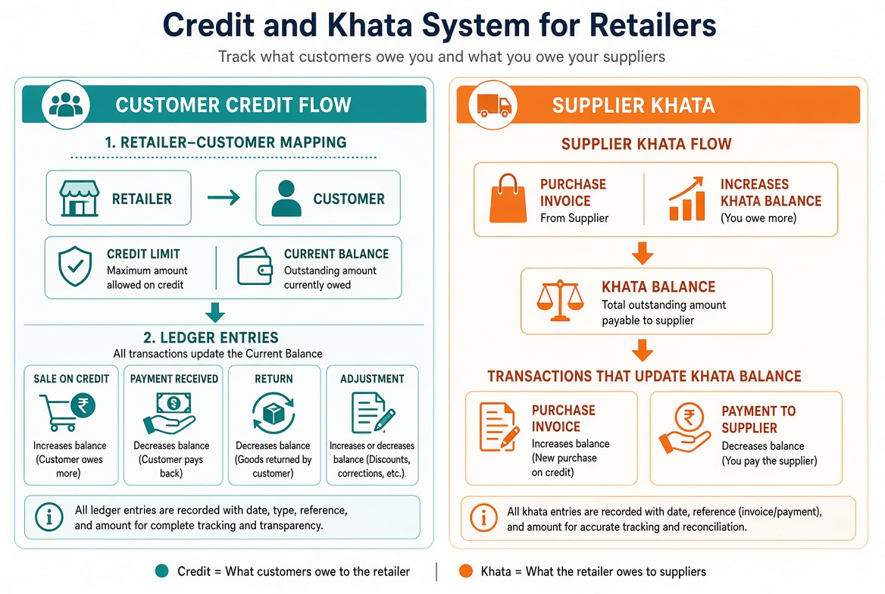
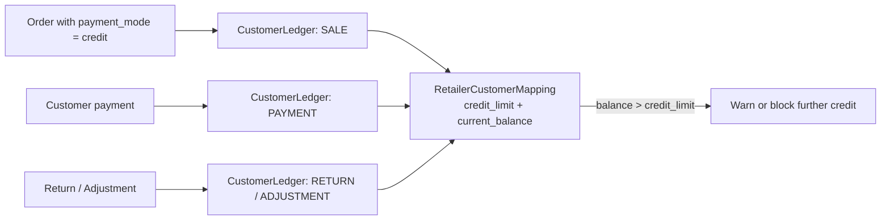

# Credit & Khata System

## Overview

The platform supports two related concepts:

- **Customer Credit** (what the customer owes the retailer)
- **Supplier Khata** (what the retailer owes suppliers)

## Customer Credit

### RetailerCustomerMapping

Each retailer-customer relationship tracks:

- `credit_limit` – maximum amount the customer is allowed to owe
- `current_balance` – current outstanding amount

### Ledger Entries

All movements are recorded in `CustomerLedger`:

| Type | Effect on Balance |
|------|-------------------|
| SALE (on credit) | Increases balance |
| PAYMENT | Decreases balance |
| RETURN | Decreases balance |
| ADJUSTMENT | Increases or decreases as needed |

### Flow

*Illustrative diagram: Left side shows Customer Credit (Retailer–Customer mapping + ledger entries that increase/decrease balance). Right side shows Supplier Khata (Purchase Invoice increases what you owe; Payment to supplier decreases it).*

## Supplier Khata

- `PurchaseInvoice` increases the amount owed to the supplier.
- Payments to the supplier decrease the balance.
- Tracked via `SupplierLedger`.

## Key Rules

- Balance is always updated in real time.
- Credit limit can be used to block or warn on further credit sales.
- Full history is available through the ledger entries.
- Customer-facing credit bills must show remaining balance on the bill itself ([credit-remaining-balance.md](../requirements/credit-remaining-balance.md), KAN-61).
