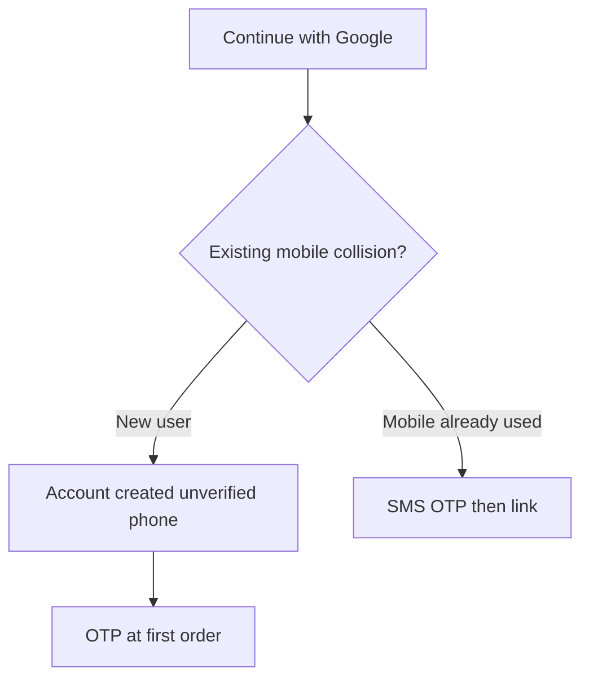

# Google social login

Durable flow extracted from [KAN-47](../tickets/KAN-47.md).

Owning code: `customer_ordereasy_njs` (Next.js + Capacitor) and this backend’s auth.

## Rule

Customer username in the database is a **verified 10-digit mobile**. Google Sign-In is a hybrid: Google identity first, **phone OTP deferred to first checkout** for new users. Do not create a duplicate customer/retailer when the mobile already exists — verify with SMS OTP before linking.

## Clients

- Android: native Google Sign-In via `@codetrix-studio/capacitor-google-auth`
- Web: Google GIS client
- Gradle: `postinstall` patches deprecated `jcenter()` / old ProGuard names in that plugin (see ticket snapshot)

## Related

- Jira: https://vin8003.atlassian.net/browse/KAN-47
- Release/build notes: [../tickets/KAN-47.md](../tickets/KAN-47.md)
