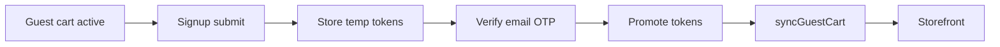

# Guest cart through signup

Durable flow extracted from [KAN-14](../tickets/KAN-14.md). Decision: [ADR-002](../decisions/ADR-002-deferred-token-guest-cart.md).

Owning code: `customer_ordereasy_njs`.

## Rule

Do not promote customer JWTs (and do not treat the user as authenticated) until email OTP succeeds. Keep the **guest cart** in local storage until then, then merge it.

## Why

Immediate `setAuthToken` on register made `isGuest = false`. CartContext then hit the backend with an unverified token and showed an empty cart. Back from `/verify-email` looked like the cart was wiped.

Syncing the guest cart onto an **unverified** account at signup is also unsafe: abandoned OTP + stale-account deletion destroys the cart.

## Behaviour

| Step | Storage / auth | Cart |
|------|----------------|------|
| Before signup | Guest | `guest_cart_<retailerId>` |
| After register, before OTP | Temp tokens only | Guest cart still used |
| OTP success with temp tokens | Active JWT | `syncGuestCart()` then authenticated cart |
| OTP success without temp tokens | — | Redirect to login |

## Related

- Jira: https://vin8003.atlassian.net/browse/KAN-14
- Implementation notes and test cases: [../tickets/KAN-14.md](../tickets/KAN-14.md)
