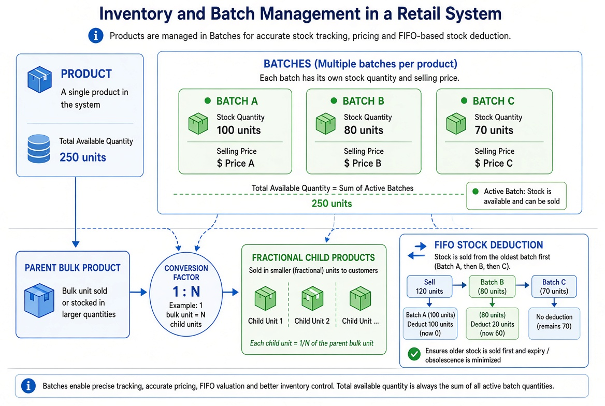

# Inventory & Batch Management

## Overview

Products can be managed either with direct quantity or with multiple independent batches. The system also supports fractional (child) products derived from a parent bulk product.

## Core Concepts

### 1. Product with Batches

- When `Product.has_batches = true`, stock is tracked at the `ProductBatch` level.
- Total available quantity on the Product is the sum of all **active** batch quantities.
- Each batch has its own selling price and stock quantity.

### 2. FIFO Stock Deduction

When an order or POS sale reduces stock:

1. The system prefers the oldest batch first (FIFO).
2. Once a batch is depleted, deduction moves to the next oldest batch.
3. Product.quantity is recomputed as the sum of remaining active batches.

### 3. Fractional / Child Products

- A **Parent Bulk Product** can have one or more **Fractional Child Products**.
- Conversion factor defines the relationship (e.g. 1 box = 10 pieces).
- Stock deductions on a child product are converted and deducted from the parent.

## Flow Diagram

*Illustrative diagram: Products can have multiple batches (each with own quantity & price). Total available stock is the sum of active batches. FIFO deduction sells oldest batch first. Parent bulk products can create fractional child products via a conversion factor.*

## Key Rules

- Only active batches contribute to available quantity.
- Completed or expired batches can be excluded from available stock.
- Fractional children inherit stock availability from the parent via the conversion factor.
