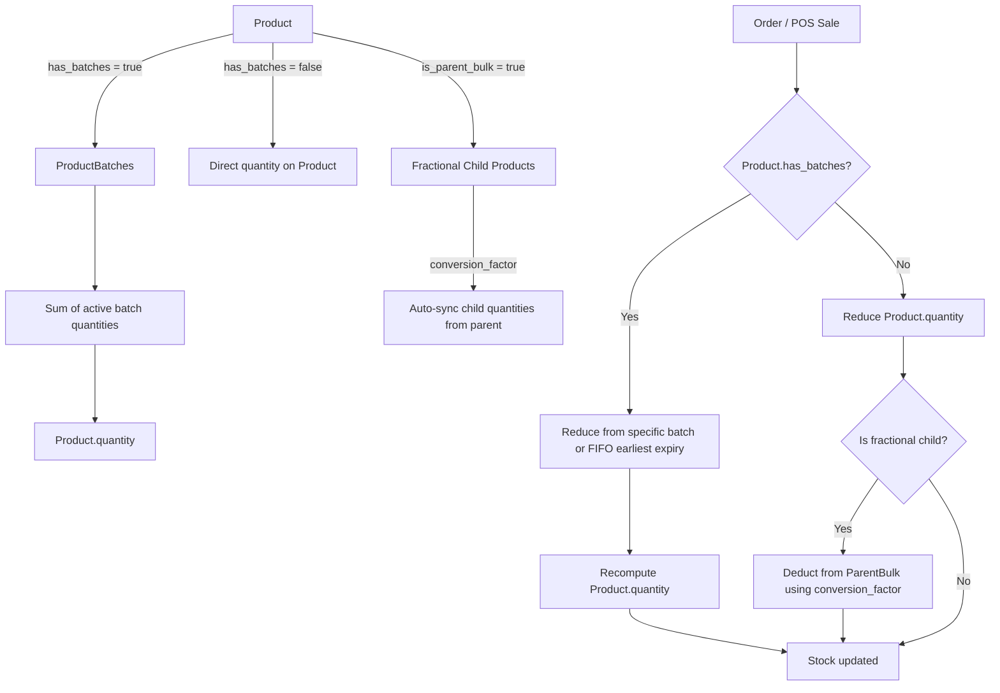

# Inventory & Batch Management

## Overview

Products can be managed either with direct quantity or with multiple independent batches. The system also supports fractional (child) products derived from a parent bulk product.

## Core Concepts

### 1. Product with Batches

- When `Product.has_batches = true`, stock is tracked at the `ProductBatch` level.
- Total available quantity on the Product is the sum of all **active** batch quantities.
- Each batch has its own selling price and stock quantity.
- Each batch may store an optional `expiry_date` (OE-136). Null expiry stays valid.

### 2. FIFO Stock Deduction

When an order or POS sale reduces stock and no specific batch is passed:

1. FIFO prefers the **earliest dated** saleable batch (`expiry_date ASC NULLS LAST`, then `created_at`).
2. Expired batches (`expiry_date < today`) are not eligible. Default policy forbids selling them; there is no org-level FIFO/expired flag in this slice.
3. Once a batch is depleted, deduction moves to the next eligible batch.
4. Product.quantity is recomputed as the sum of remaining **active** batches (expired qty stays on that total until a write-off).

### 3. Fractional / Child Products

- A **Parent Bulk Product** can have one or more **Fractional Child Products**.
- Conversion factor defines the relationship (e.g. 1 box = 10 pieces, or `0.10` of a 50kg bag). Factor must be **> 0**.
- Stock deductions on a child product are converted and deducted from the parent (`EXISTING` on `Product.reduce_quantity`; POS and customer checkout already call it).
- Changing `conversion_factor` / `parent_bulk_product` / `is_parent_bulk` requires `inventory.adjust` (`EXTEND`, OE-103). `parent_bulk_product` cycles are rejected.

## Flow Diagram

*Illustrative diagram: Products can have multiple batches (each with own quantity, price, and optional expiry). Total listed stock is the sum of active batches. FIFO deduction sells the earliest expiry first. Parent bulk products can create fractional child products via a conversion factor.*

## Key Rules

- Hand-set `Product.quantity` / `ProductBatch.quantity` on product update or bulk requires `inventory.adjust` (see [inventory-adjust-permission.md](../requirements/inventory-adjust-permission.md)). Cashiers cannot type a new on-hand number. Sales and purchases still change stock through their existing paths.
- Setting or changing `ProductBatch.expiry_date` on product update also requires `inventory.adjust` (echo allowed). Bulk does not write expiry. See [product-batch-expiry.md](../requirements/product-batch-expiry.md).
- Only active batches contribute to `Product.quantity`. Expired batches cannot be sold; `can_order_quantity` uses saleable qty. Retailer/POS product reads expose that saleable figure as `saleable_quantity` (see [saleable-quantity-reads.md](../requirements/saleable-quantity-reads.md)).
- Damage / expiry / spoilage write-off decreases on-hand and posts `ProductInventoryLog` with a reason code (see [damage-expiry-write-off.md](../requirements/damage-expiry-write-off.md)). Expiry write-off cannot target a non-expired batch. Shop expiry **list** read is [expiry-batch-list.md](../requirements/expiry-batch-list.md). Full E16 MIS screens stay later.
- Store vs owned-app **prices** share this same on-hand / saleable pool. `Product.app_price` does not create a second stock (see [app-vs-pos-prices.md](../requirements/app-vs-pos-prices.md)).
- Fractional children inherit stock availability from the parent via the conversion factor.
- Sale deducts (POS and customer `place_order`) cannot take on-hand below zero unless the caller already passes `allow_negative=True` on `Product.reduce_quantity`. POS accepts that flag as JSON `true` only. See [block-negative-stock.md](../requirements/block-negative-stock.md). Last-unit sales serialize on one `Product.lock_for_sale` (sold SKUs + pack parents, pk ASC) before `reduce_quantity`.
