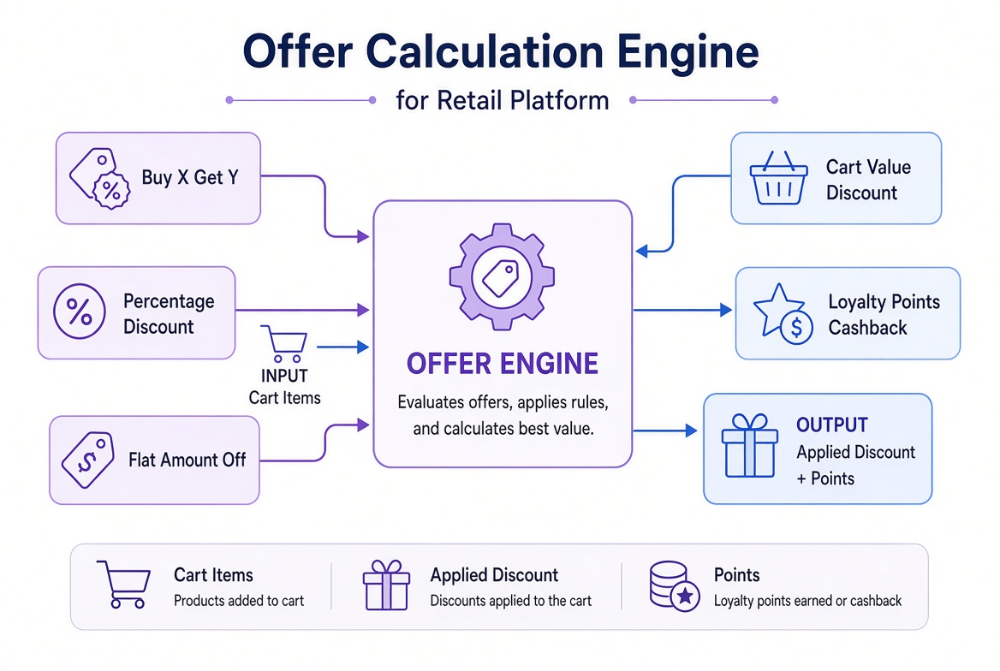
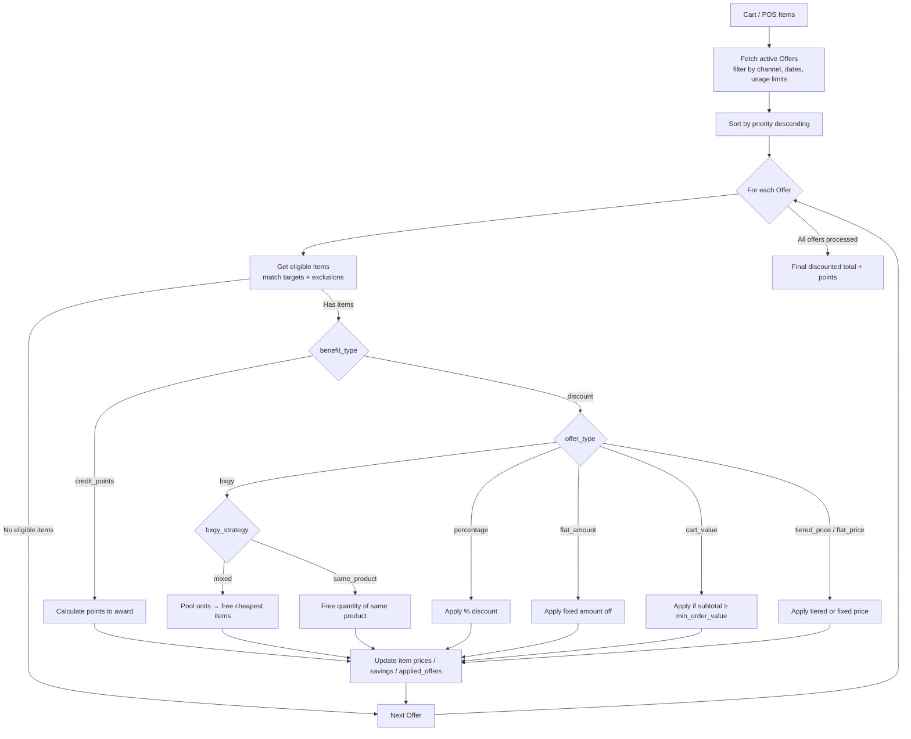

# Offer Calculation Engine

## Overview

The offer engine evaluates active offers against a cart (or POS items) and applies discounts or awards loyalty points according to configured rules.

## Supported Offer Types

| Offer Type | Description |
|------------|-------------|
| `bxgy` | Buy X Get Y (free or discounted) |
| `percentage` | Percentage discount on eligible items |
| `flat_amount` | Fixed amount off |
| `cart_value` | Discount when cart subtotal reaches a threshold |
| `tiered_price` / `flat_price` | Quantity-based or fixed pricing |

## Benefit Types

- **discount** → reduces the order total
- **credit_points** → awards loyalty points instead of (or in addition to) a discount

## Application Flow

*Illustrative diagram: Cart items enter the Offer Engine, which evaluates BXGY, percentage, flat amount, cart-value and other rules, then outputs applied discounts and/or loyalty points.*

## Key Rules

- Offers are processed in priority order.
- Stackability and exclusivity rules are respected.
- Channel filtering (POS vs App) is supported.
- Usage limits and validity dates are enforced.
