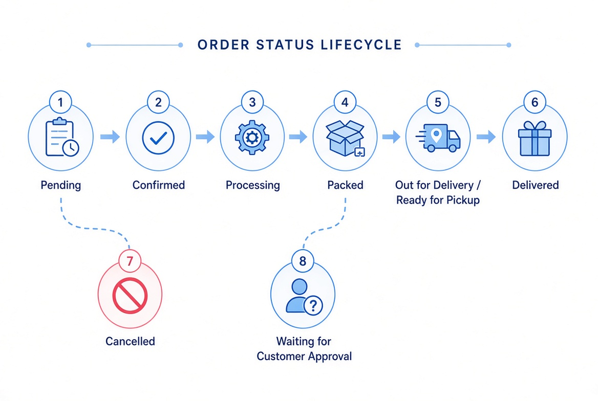
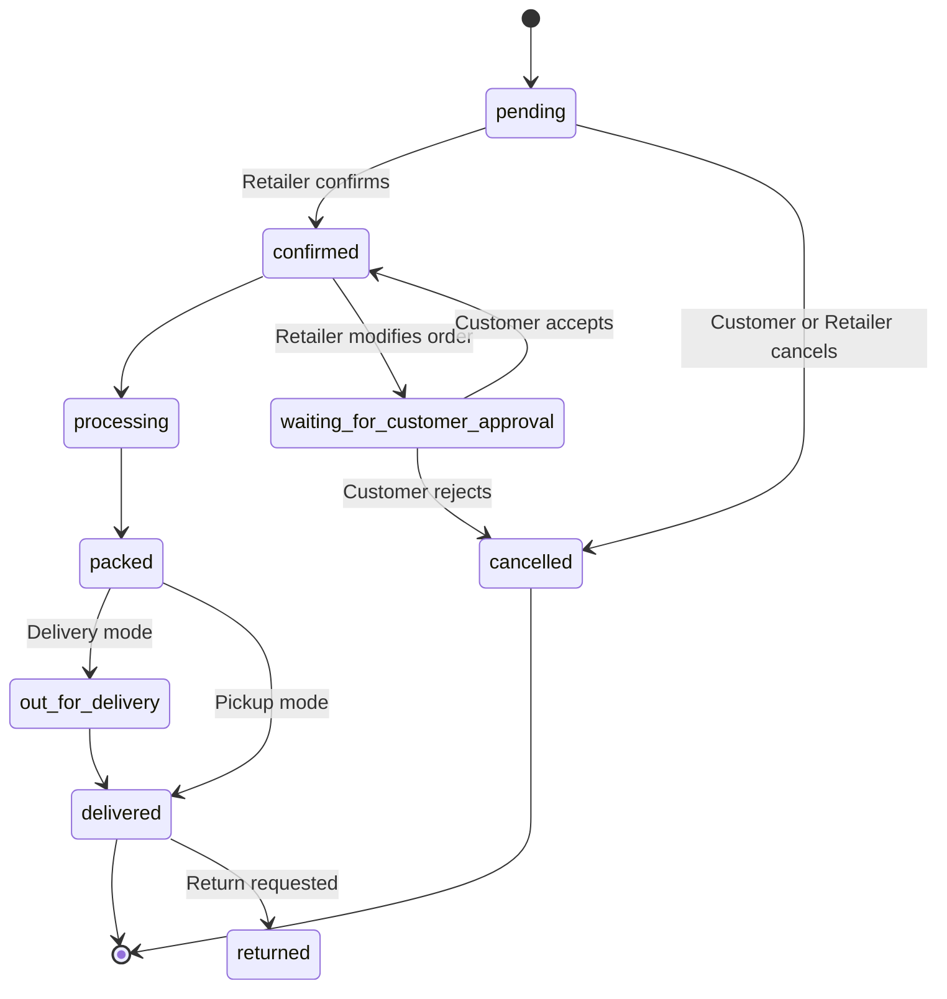

# Order Lifecycle

## Overview

Orders move through a well-defined set of statuses. The backend enforces valid transitions.

## Status State Machine

*Illustrative diagram showing the main happy path (Pending → Confirmed → Processing → Packed → Out for Delivery / Ready for Pickup → Delivered) plus the Cancelled and Waiting for Customer Approval branches.*

## Key Rules

- `pending` is the initial state after a customer places an order.
- Retailer can confirm, cancel, or modify an order.
- If the retailer modifies the order, it moves to `waiting_for_customer_approval`.
- Delivery orders go through `out_for_delivery`; pickup orders go directly from `packed` to `delivered`.
- Status transitions are enforced by the backend policy (`orders/domain/status_policy.py`).

## Related Models

- `Order`
- `OrderStatusLog`
- `OrderItem`
