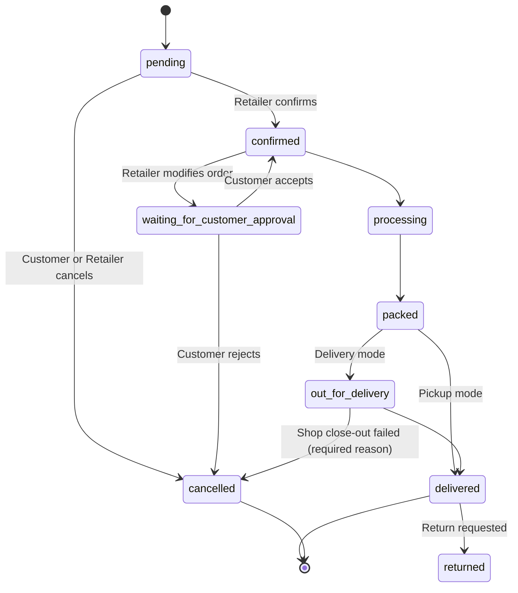

# Order Lifecycle

## Overview

Orders move through a well-defined set of statuses. The backend enforces valid transitions.

## Status State Machine

*Illustrative diagram showing the main happy path (Pending → Confirmed → Processing → Packed → Out for Delivery / Ready for Pickup → Delivered) plus the Cancelled and Waiting for Customer Approval branches.*

## Key Rules

- `pending` is the initial state after a customer places an order.
- Retailer can confirm, cancel, or modify an order.
- If the retailer modifies the order, it moves to `waiting_for_customer_approval`.
- Delivery orders go through `out_for_delivery`; pickup orders go directly from `packed` to `delivered`.
- Shop close-out from OFD can mark **delivered** (existing `mark_delivered` / `status=delivered`) or **failed** (`mark_failed` / `status=cancelled` with a required reason). Failed writes `Order.cancellation_reason` + `cancelled_by='retailer'`, restores reserved stock, and sets `OrderDelivery.delivery_status='failed'` when a delivery row exists. There is no `Order.status=failed` and no `order.status.failed` event — notify reuses `order.status.cancelled`.
- Status transitions are enforced by the backend policy (`orders/domain/status_policy.py`).
- There is no separate delivery/rider app. Shop-level dispatch stays on this API ([ADR-001](../decisions/ADR-001-no-delivery-app.md), KAN-58).

## Related Models

- `Order`
- `OrderStatusLog`
- `OrderItem`
