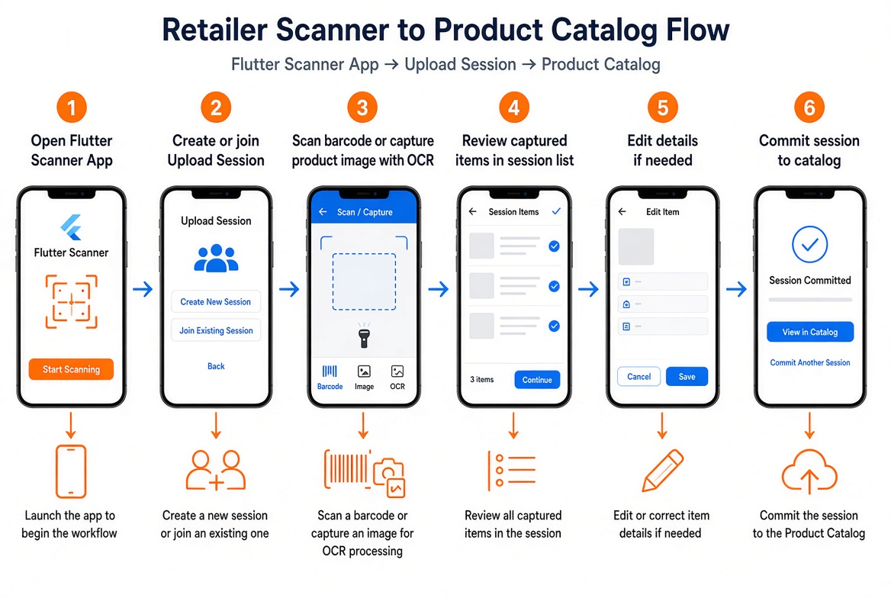

# Products and stock

Your **product catalog** is what customers see online and what staff search at POS. Keeping it accurate is one of the most important jobs on OrderEasy.

## Product list

Open **Products** to see everything in your catalog. Each product typically has:

| Field | Purpose |
|-------|---------|
| Name | What customers and staff search for |
| Selling price | Current price |
| MRP | Printed price on pack (optional) |
| Barcode | For POS scan |
| Category | Organisation and browsing |
| Stock quantity | How many available |
| Images | Photos for customer app |
| Active / inactive | Hide without deleting |

## Adding one product

1. Products → **Add product**
2. Fill name, price, unit, category
3. Add barcode if available
4. Upload photo (helps online sales)
5. Set opening stock if tracking inventory
6. Save

## Categories

**Categories** group products for customer browsing (e.g. "Snacks", "Cleaning").

- Create categories before bulk-adding products
- A product usually belongs to one primary category
- Keep category names simple — customers scan them quickly

## Stock tracking

OrderEasy can track stock in two ways:

### Simple quantity

One number per product — goes down on sale, up on purchase or return.

### Batch tracking

For items bought at different costs or expiry dates:

- Each **batch** has its own quantity and purchase price
- Sales consume stock FIFO (oldest batch first) by default
- Useful for groceries with expiry or varying wholesale rates

*Illustration: how batch stock ties to purchases and sales.*

→ Technical detail: [inventory flow in docs](../docs/07-KEY-FLOWS/inventory-and-batches.md)

## Bulk products (parent / child)

Some items sell both wholesale and retail:

- **Parent:** Carton of 24 bottles
- **Child:** Single bottle

Linking them keeps stock in sync when you break a case.

## Adding many products at once

### Excel upload

1. Products → **Bulk add** → Excel template
2. Fill rows offline
3. Upload file
4. Review errors and confirm

Best when you already have a spreadsheet.

### Scanner app + review

1. Staff walks aisle with **scanner app** — scan barcodes, photo labels
2. Session syncs to cloud
3. Retailer app → Products → **Bulk add** → open session
4. Review, fix names/prices, **commit** to live catalog

→ [Scanner guide](../scanner-guide/README.md)

## Editing and deactivating

| Action | When |
|--------|------|
| **Edit price** | Regular price change |
| **Deactivate** | Seasonal item, not selling now — hidden from customers |
| **Delete** | Rare — prefer deactivate to keep history |

Inactive products may still appear in old orders and reports.

## Product ledger

**Product ledger** shows stock movements — sales, purchases, adjustments. Use it to answer "why is stock X?"

## Tips

| Tip | Why |
|-----|-----|
| Photograph top sellers first | Online conversion improves with images |
| Barcode every SKU you can | Faster POS |
| Reconcile stock weekly | Catch theft, damage, or data entry gaps |
| Match online price to counter | Avoid customer arguments |

→ [Purchases and suppliers](purchases-and-suppliers.md) · [POS billing](pos-billing.md)
